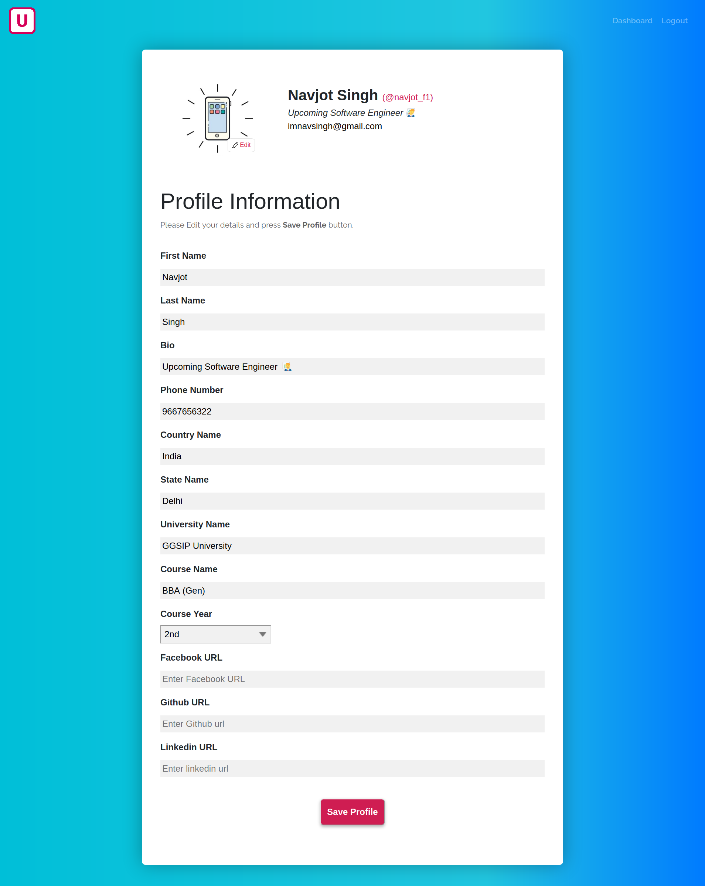
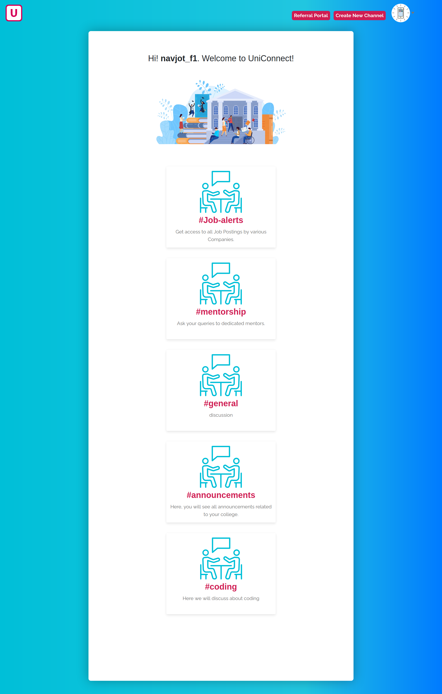
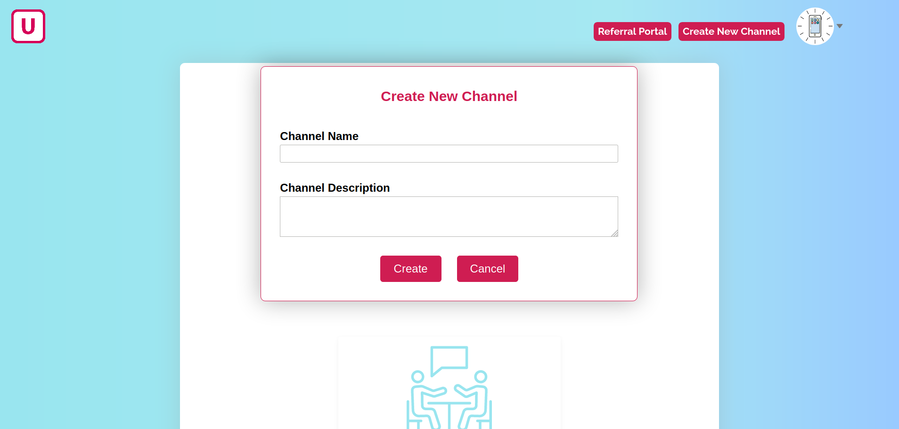

# UniConnectWT
UniConnect is a Web Application where peers can collaborate having discussions in dedicated channels. User can create channels, posts and reply on the ongoing discussions. Alumni Referral Portal hasbeen integrated so that users can search alumni by specifying company name from the Database.

## Screenshots : 

 
 

 

 

 

 
 
 
 
